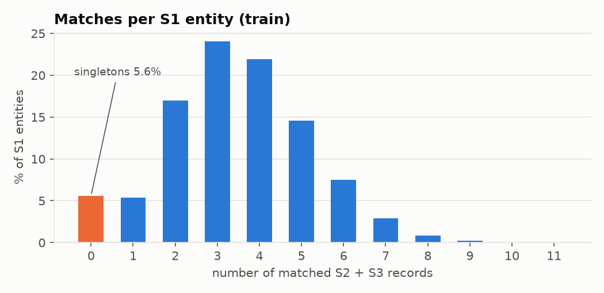
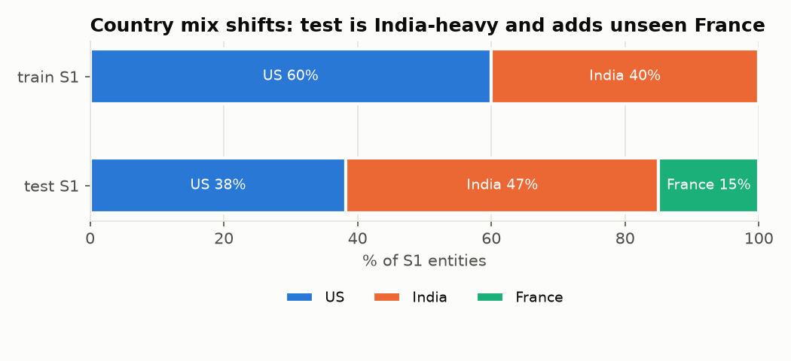
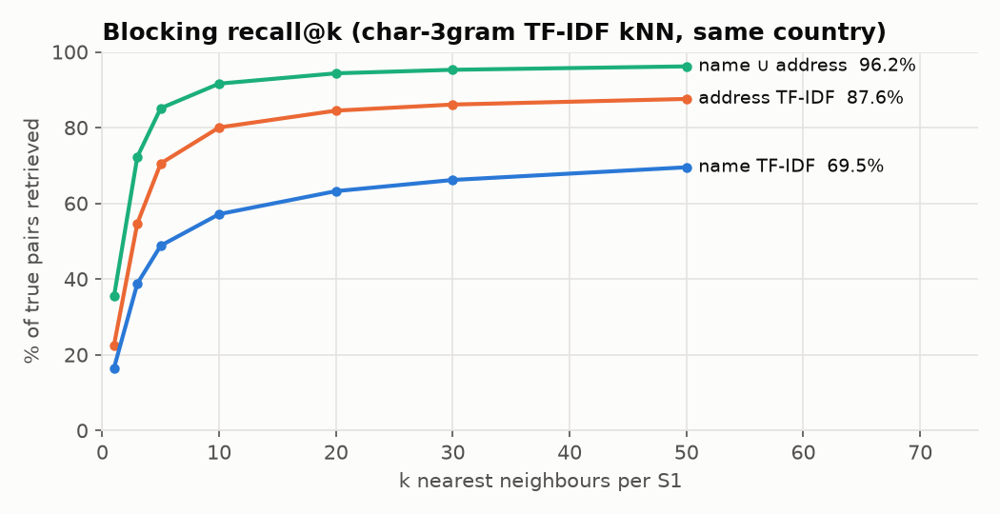
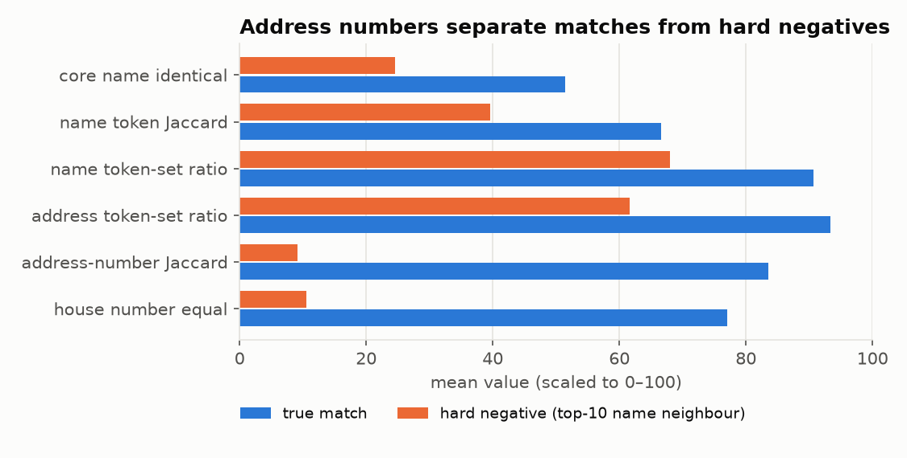

# EDA Report: Business Entity Resolution (Amazon ML Challenge 2026)

**Status:** first full pass, 2026-09-25 (day 1).
**Reproduce:** the scripts in [`eda/`](../eda) run in order `00 → 09`. Raw outputs are in [`eda/outputs/`](../eda/outputs) and figures in [`eda/figures/`](../eda/figures).
**Related docs:** [01_PROBLEM_KEY_POINTS.md](01_PROBLEM_KEY_POINTS.md) · [02_DECISION_LOG.md](02_DECISION_LOG.md)

---

## TL;DR: the 12 findings that shape the solution

1. **The data is synthetic and follows a pattern.** S1 is perfectly clean. S2 and S3 are S1 records passed through source-specific noise functions. Every noise operation we found can be inverted. **Canonicalisation is the highest-leverage step.**
2. **Only 5.6% of S1 are singletons.** The typical entity has 3–4 matches (mean 3.66 for non-singletons), split about evenly between S2 and S3. Recall still matters a lot.
3. **Each S2/S3 record belongs to at most one S1** (0 violations in 7.6M pairs). The ground truth is a partition, so assignment constraints apply.
4. **The country label agrees in 100% of true pairs.** Country is a free, lossless blocking key.
5. **About 26% of S2/S3 records match nothing (distractors).** Test has **~23% more S2+S3 records per S1** than train (5.76 vs 4.68), consistently in every country. Distractor density in test is likely around 1.9× train.
6. **40% of S1 names are shared with at least one other S1 entity** (up to 253 per name). A name alone cannot decide a match. **The address, especially the house number, decides.**
7. **The data contains planted decoys**: same name and same street as an S1 entity, but a slightly shifted house number (1643→1647). 99.3% of these near-duplicates are distractors. They are the main precision trap.
8. **Native-script names** (Devanagari, Telugu, Kannada, Tamil, Bengali, Gujarati, Malayalam, Odia, Gurmukhi) appear in 24% of India S2 names and 13% of India S3 names. The vocabulary is **closed (1,518 tokens) and 100% of test tokens appear in train**. A position-aligned dictionary learned from train is **96.6% pure**.
9. **Blocking:** global char-3gram TF-IDF gets **96.2% recall@50** (name ∪ address). Name alone gets only 69.5%, address alone 87.6%. It is also far too slow at full scale, so blocking must be multi-key and geography-scoped.
10. **Postal codes are essentially absent** (0.3% of India addresses have a PIN, and US "zip-like" tokens are house numbers). Blocking uses state, city and street instead.
11. **Addresses are partial**: 55% of India S2 matches drop at least one address part. Address similarity must be **asymmetric (containment)**, not symmetric.
12. **Test adds France (15% of test S1), which is unseen in train.** Its noise rates match the other countries, but its geography is very concentrated (about 15 main cities) and names embed city names ("Bordeaux Club" ×530). Country-agnostic features and French-specific normalisation are needed.

---

## 1. Data inventory and integrity
| File | Rows | Unique IDs | Null name | Null address |
|---|---:|---:|---:|---:|
| train_source1 | 2,206,821 | 2,206,821 | 0 | 0 |
| train_source2 | 5,034,616 | 5,034,616 | 0 | 168,967 (3.4%) |
| train_source3 | 5,285,603 | 5,285,603 | 0 | 175,916 (3.3%) |
| train_ground_truth | 2,206,821 | 2,206,821 | — | 123,247 empty lists |
| test_source1 | 1,732,544 | 1,732,544 | 0 | 0 |
| test_source2 | 4,887,273 | 4,887,273 | 0 | 129,408 (2.6%) |
| test_source3 | 5,082,316 | 5,082,316 | 0 | 136,098 (2.7%) |

- Parsing with TAB and no quoting gives rows = physical lines − 1 for every file, so parsing is exact.
- There are **no nulls in S1**. S1 is the clean reference.
- In S2/S3, besides true nulls, 3–4% of addresses contain **null-like tokens** (`null`, `NULL`, `<NULL>`, `N/A`) inside the text, e.g. `34, Krishna Nagar, <NULL>, UP`. These must be stripped.
- A few names are literally "null" or "None" (6–61 per file).
- Exact duplicate (name, address, country) rows within a source: S2 25,873 and S3 18,860. This is expected, because one S1 can have up to 5 matches from the same source.
- IDs are `S{1,2,3}-<random int up to 1e9>` (see §9 for leakage checks).

## 2. Ground-truth structure

| Stat | Value |
|---|---|
| Positive pairs | **7,638,365** (S2: 3,693,619 · S3: 3,944,746) |
| Singletons | **123,247 = 5.58%** (US 5.58%, India 5.59%) |
| Matches per S1 (all) | mean 3.46 · mode 3 · max 11 |
| Matches per non-singleton | mean 3.66 |
| S2 matches per S1 | 0:13% · 1:36% · 2:30% · 3:15% · 4:5% · 5:1% |
| S3 matches per S1 | 0:12% · 1:32% · 2:30% · 3:17% · 4:7% · 5+:2% |
| Most common (n2, n3) | (1,1) 12% · (1,2) 11% · (2,1) 10% · (2,2) 9% |
| S2/S3 IDs matched to more than one S1 | **0** (strict partition) |
| Country agreement in true pairs | **100.00%** |
| S2 matched / distractor | 73.4% / 26.6% (1.34M distractors) |
| S3 matched / distractor | 74.6% / 25.4% (1.34M distractors) |

**Implications**
- An entity can match several records **from the same source**, so we must not force 1 match per source.
- Because the GT is a partition, conflict resolution is safe: when two S1s claim one S2/S3 record, give it to the higher-scoring S1 (D-007).
- Cluster statistics are identical for US and India, so the generator is country-independent. We expect France to follow the same cardinality distribution.

## 3. Train → test shift

| Split | Country | S1 | S2 | S3 | (S2+S3)/S1 |
|---|---|---:|---:|---:|---:|
| train | US | 1,323,633 | 3,016,817 | 3,170,056 | 4.67 |
| train | India | 883,188 | 2,017,799 | 2,115,547 | 4.68 |
| test | US | 663,106 | 1,871,330 | 1,945,701 | **5.76** |
| test | India | 809,986 | 2,312,565 | 2,405,000 | **5.82** |
| test | France | 259,452 | 703,378 | 731,615 | **5.53** |

- The country mix changes from 60/40 US/India in train to 38/47/15 US/India/France in test. **India's weight roughly doubles relative to US**, so India-specific difficulties (native script, partial addresses, lower blocking recall) matter more on the leaderboard than on a naive train validation.
- There are about 1.1 extra S2/S3 records per S1 in test. If matches per S1 stay at about 3.46 (the cluster statistics are generator-driven, so this is likely), then **distractors per S1 go from 1.21 to about 2.3**. One plausible cause is that test S1 was subsampled while its S2/S3 records were kept as orphans.
- **Validation must reproduce this** by dropping ~20% of validation S1 entities from the query set while keeping their records in the pool (D-010). Otherwise local precision and thresholds will be optimistic.
- Per-source noise rates (§4) are identical between train and test within each country. **The noise generator is the same**, so train-learned rules transfer.

## 4. Text profile: where the noise lives
Source: `eda/03_text_profile.py`, 300k-row sample per file. Selected rates for **train**; test is within ±0.01.

| Metric | S1 US | S2 US | S3 US | S1 IN | S2 IN | S3 IN |
|---|---:|---:|---:|---:|---:|---:|
| name non-ASCII | 0 | 6.7% | 6.7% | 0 | **27.7%** | **18.4%** |
| name accent added (é, ú…) | 0 | 6.7% | 6.7% | 0 | 4.3% | 5.4% |
| name leetspeak (Ca1lahan) | 0 | 3.0% | 3.0% | 0 | 2.3% | 2.4% |
| name double space | 0 | 11.7% | 11.2% | 0 | 10.1% | 10.6% |
| name ALL CAPS | 0 | 21.5% | 3.3% | 0 | 15.0% | 2.6% |
| name all lowercase | 0 | 6.7% | 7.0% | 0 | 4.6% | 5.2% |
| name has website (.com/www) | 0 | 4.4% | 4.3% | 0 | 3.4% | 3.6% |
| name leading junk (`--`, `<<`, `#`) | 0.1% | 2.5% | 2.4% | 0.1% | 1.7% | 1.7% |
| name brackets `( ) [ ]` | 0 | 6.5% | 6.6% | 5.2% | 9.4% | 10.1% |
| name "formerly" | 0 | 0 | 0.7% | 0 | 0 | 0.4% |
| name DBA/aka | 0 | 0 | 1.6% | 0 | 0 | 1.1% |
| addr ALL CAPS | 0 | **93%** | 0 | 0 | 25% | 0 |
| addr native script | 0 | 0 | 0 | 0.1% | 24.5% | 23.2% |
| addr null token inside | 0 | 4.1% | 3.8% | 0 | 3.0% | 2.9% |
| addr has `#` | 0.3% | 5.4% | 10.5% | 1.3% | 11.3% | 10.8% |
| addr PO Box | 0 | 1.8% | 1.6% | 0 | 0 | 0 |
| addr "near/opp" landmark | 0 | 0 | 0 | 13.2% | 11.6% | 8.9% |
| addr leading-zero number (014206) | 0.1% | 5.2% | 4.9% | 1.6% | 3.9% | 3.7% |
| addr length (chars) | 35 | 33 | 40 | 78 | 70 | 61 |
| addr parts (commas+1) | 3.2 | 3.1 | 3.2 | 5.7 | 5.0 | 4.9 |

**Source "styles":**
- **S2** writes addresses in UPPERCASE with USPS-style abbreviations (`ST`, `AVE`, `RD`) and keeps the state code (`TX`). For India it keeps the state in title case or native script. It sometimes writes names in all caps.
- **S3** uses title case, abbreviates street types (`Ave`, `Dr`), and **spells out state names** (`Texas`, `North Carolina`) or uses short codes (`MH`, `DL`, `KA`) for India. It adds `# unit`, `PO Box`, and "formerly:" or DBA names.
- **US addresses** follow `num street, [Unit X], city, ST` with the components rotated (`OH, Columbus, 5559 Orville Avenue`). India addresses are long, free-form lists with landmarks.

## 5. Noise-operation catalogue (true pairs, S1 → match)
Source: `eda/06_noise_catalog.py`, 150k sampled positive pairs.

| Operation | IN·S2 | IN·S3 | US·S2 | US·S3 |
|---|---:|---:|---:|---:|
| name identical verbatim | 2.7% | 2.7% | 6.1% | 5.6% |
| name identical after normalisation | 22.9% | 25.7% | 33.1% | 32.9% |
| **core name identical** (legal suffix removed) | 44.5% | 47.2% | 56.8% | 53.2% |
| legal suffix changed | **47.6%** | 40.5% | 27.7% | 24.2% |
| core tokens reordered | 0.9% | 0.8% | 3.3% | 3.1% |
| core token dropped | 1.0% | 1.9% | 7.2% | 7.8% |
| core token added ("Services", "Center", "Dr", "Sri") | 8.3% | 12.1% | 3.0% | 7.2% |
| native-script name | **23.6%** | **12.9%** | 0 | 0 |
| website-style name (`lesieurmustang.com`, `#higher`) | 4.4% | 4.8% | 5.6% | 5.4% |
| "formerly:" (random alias + real name) | 0 | 0.5% | 0 | 1.0% |
| accent added | 4.9% | 6.0% | 7.5% | 7.5% |
| leetspeak | 1.4% | 1.5% | 2.2% | 2.1% |
| address null | 3.8% | 4.1% | 5.0% | 4.6% |
| address parts **dropped** | **55.4%** | 39.2% | 18.6% | 6.7% |
| address parts reordered | 4.2% | 1.6% | 5.7% | 2.1% |
| first address part moved | 17.4% | 16.8% | 13.6% | 9.6% |
| address numbers identical (set) | 71.2% | 65.9% | 60.8% | 70.3% |
| address numbers ⊆ S1 numbers | 67.9% | 67.9% | 72.1% | 74.9% |
| house number changed (no overlap) | 2.2% | 2.7% | 6.8% | 5.8% |
| US state equal (when parseable) | — | — | 99.8% | 99.8% |

Observed typo mechanics: character swaps (`Raeligh`, `Scaramento`), drops (`Monre`), letter doubling (`Hauute`), OCR-like substitutions (`B1btnf`, `lnflection`), city → county/township/CDP substitution (`Woodbury → Saint Paul Township`, `City of Menomonie`, `Tacoma CDP`), and a prefixed house number (`H.no 922 G-15/6`, `#773 A 141`).

**Implications**
- Only about half of true pairs share an identical core name, so fuzzy name similarity is essential. Legal suffixes flip 25–48% of the time, so they should be a *weak* feature and never a hard requirement.
- Because of dropped parts, address similarity must include **containment** measures: `|A∩B|/|B|` (how much of the shorter record is in the longer one), `partial_ratio`, and number-set ⊆.
- State agrees at 99.8% when parseable, so it is a strong US soft-block and feature. It is missing about 5% of the time (null addresses).

## 6. Native-script names: a closed, learnable vocabulary
Source: `eda/06_noise_catalog.py`, `eda/07_translit_dictionary.py`.

- Distinct native tokens in India names: **1,518 in train and 1,518 in test. 100% of test token occurrences are covered by train.** The generator translates from a fixed word list.
- Aligning tokens by position (same token count, fully native names: 510,890 pairs, 92.7% of native-name pairs) learns **1,347 tokens with 96.6% weighted purity**. 1,304 tokens are at least 90% pure.
- Impurity comes from **genuine English spelling variants** in S1: लक्ष्मी → laxmi/lakshmi, जय → jay/jai, श्री → shree/sri/shri, and Telugu/Kannada/Tamil "limited" → limited/ltd (84%). We map each native token to a *set* of English variants, or canonicalise the variants on the English side too.
- `unidecode` alone gives poor romanisation (`redd phuudds praaivett limittedd`), so the **learned dictionary is the right tool**. It uses only training data, so it complies with the no-external-data rule.
- Native script also appears in **addresses** (about 24% of India S2/S3), mostly state names (`महाराष्ट्र`, `ಕರ್ನಾಟಕ`, `दिल्ली`). The same alignment approach works, or a small state table.

## 7. S1 name ambiguity
| Key | S1 rows sharing their key with ≥1 other S1 in the same country |
|---|---|
| raw name | 38.3% (max group 253) |
| normalised name | 40.0% |
| core name (no legal suffix) | **49.5%** (max 567: "meridian") |
| (core name, first address part) | **0.2%** |

Test is similar (37.5% / 46.9%), and the top shared core names are French: "bordeaux club" ×530, "nantes club" ×486. Common core names are generic words (Meridian, Cedar, Summit, Family Center, Ear Nose Throat Group).

**Implication:** add a **name-frequency / ambiguity feature**: how many S1 in the same block share this core name, or the IDF of the name tokens. When the name is ambiguous, the model must require address agreement.

## 8. Blocking experiments

Setup: 20,000 random train S1 (69k true pairs), searched against the **full** same-country train S2+S3 pool (6.2M US, 4.1M India). Normalised text, char-3gram TF-IDF, cosine top-50 (`eda/04_blocking_similarity.py`).

| k | name | address | union |
|---:|---:|---:|---:|
| 1 | 16.5% | 22.5% | 35.4% |
| 5 | 48.8% | 70.5% | 85.1% |
| 10 | 57.2% | 80.0% | 91.6% |
| 20 | 63.2% | 84.5% | 94.3% |
| 50 | 69.5% | 87.6% | **96.2%** |

- Per country at k=50 (union): **US 97.8%, India 93.8%**. Per source: IN·S3 92.6% is the weakest, then IN·S2 95.1%, US·S2 97.9% and US·S3 97.7%.
- Found positives have median best rank 1 and 75th percentile 2. When retrieval works, it works early.
- **Why name kNN is weak:** the neighbourhood of a generic name ("Summit Inc") is flooded by other entities with the same name.
- **What is missed** (2,642 of 69k, `eda/04b_blocking_misses.py`):

| Condition | Share of positives | Miss rate | Share of misses |
|---|---:|---:|---:|
| native-script name | 13.9% | 9.5% | **34.5%** |
| null address | 4.4% | 21.9% | **24.9%** |
| core-name ratio < 60 (alias, website, formerly) | 11.5% | 11.3% | 34.1% |
| identical core name | 51.5% | 0.7% | 9.0% |

- **Speed:** a brute-force global kNN over 6.2M records ran at about 16 queries/s. At that rate the 1.7M test S1 would take **30+ hours**, so it is not viable. The production blocker must (a) scope by geography (country → state/city), (b) drop very frequent n-grams/tokens (ltd, pvt, st, road), and (c) use inverted-index exact keys for the easy majority (D-011).

**Blocking design (from these numbers):** a union of
1. canonical-name keys (after transliteration, leet fix, website split and "formerly" handling) within the country,
2. house-number plus street-token plus city keys,
3. rare-name-token inverted index within state/city,
4. TF-IDF top-k within the state/city block for the fuzzy tail.

Target: **≥99% recall with about 20–40 candidates per S1**, measured on train.

## 9. Leakage checks (none found)
- Correlation between S1 and match ID numbers: **0.0001**. S1 and match row positions: **0.0001**. GT row order vs S1 row order: **0.0003**.
- 15,881 coincidental equal ID numbers across sources, which matches chance (≈2.2M×7.6M/1e9).
- Conclusion: IDs and file order are random. We do not use them (D-005).

## 10. Hard negatives and planted decoys (the precision battleground)

Hard negatives are the top-10 name-TF-IDF neighbours that are not matches. Comparison with true pairs (`eda/04_pair_features.parquet`):

| Feature (mean) | True pairs | Hard negatives |
|---|---:|---:|
| core name identical | 0.51 | **0.25** |
| name token-set ratio | 91 | 68 |
| address token-set ratio | 93 | 62 |
| address-number Jaccard | **0.84** | **0.09** |
| house number equal | **0.77** | **0.10** |
| US state equal | 0.997 | 0.495 |

- **A quarter of hard negatives have exactly the same core name.** Names alone cannot separate them. The address numbers can.
- **Planted decoys:** among negatives with an identical core name and address token-set ≥ 80 (3,507 in the sample, about 0.18 per S1), **99.3% are distractors** (unmatched records). They are not other entities' matches. They copy the name (with a legal-suffix tweak) and the street, city and unit, but **shift the house number**: 1643→1647, 1301→1308, 525→532, 4845→4854, 1823→1825, 5124→5125.
- **True pairs also perturb numbers** (5.2% have no number overlap), but differently: leading zeros (`014206`), a dropped digit (`3391→391`), ranges (`1357-1361`), and prefixed plot numbers (`H.NO 922 G-15/6`).
- **Implication:** house-number features are the precision lever. We need exact equality after stripping zeros, subsequence/substring, numeric gap `|a−b|`, same digit count, digit-multiset equality, and last-digit equality (D-013). Decoy density is likely higher in test (§3).

## 11. Singletons
- Singletons have **near-identical name neighbours**: median top-1 name cosine 0.974 vs 1.0 for entities with matches. Their best hard negative is as name-similar as other entities' (94% token-set ≥ 95).
- Their best name neighbour has the same weak address agreement (house number equal 5%).
- So **singleton detection = "no candidate passes the address test"**, which the pair model plus the per-entity decision rule handles. No separate classifier is needed at first.
- Value: singletons are 5.6% of entities, and each is worth 1.0 when predicted empty. One false positive zeroes it.

## 12. France (test only)
- It is 15% of test S1. Its noise rates match the other countries: website 3.5%, double space 9%, brackets 10%, null address 2.9%, `#` 3.5%. Native script does not apply, but **accents are real** (27.9% of S1 addresses, 15.7% of S1 names).
- Legal forms: SARL, SAS, SASU, SA, SCI, EURL, SNC, EI (69% of S1 names). They can appear as prefix or suffix (`SAS LVKS Spôrtive`).
- Geography is concentrated in 3 regions (Hauts-de-France, Nouvelle-Aquitaine, Pays de la Loire) and about 15 main cities (Bordeaux 43k, Nantes 37k, Lille 34k, …). S2/S3 swap **region ↔ department** (Nouvelle-Aquitaine ↔ Gironde; Hauts-de-France ↔ Nord; Pays de la Loire ↔ Loire-Atlantique) or drop it.
- Street-type abbreviations: `Rue/R.`, `Avenue/Av./Ave`, `Boulevard/Bd`, `Place/Pl`, `Allée`, `Impasse`, `Quai`, `Route/Rte`. House-number suffixes: `bis/ter/B` (`45BIS`, `5 bis`, `40B`).
- Names embed city names and generic words ("Bordeaux Club", "Lille Ecole"), so **name ambiguity is higher than in US or India**. Blocks by city are huge (Bordeaux ~43k S1), so blocking must use street and house number too.
- There are no postal codes and no Indic script.
- **Implication:** France is a zero-shot country. Rely on **relative, country-agnostic features** and add French abbreviation, accent and region↔department normalisation (generic language knowledge). Validate generalisation with **leave-one-country-out** (train US → test India) (D-014).

## 13. Consolidated implications (EDA → design)
| Stage | Design choice | Evidence |
|---|---|---|
| Normalise | Invert every noise op: transliteration dict, leet, accents, junk, website split, "formerly", legal canonical, street/state abbreviations, null tokens, French forms | §4, §5, §6, §12 |
| Block | Country hard key; multi-key union within state/city; inverted index; recall-audited ≥99% | §2, §8 |
| Pair model | GBDT on name, address, **house-number**, containment, ambiguity, rank and context features; hard negatives from our own blocker | §7, §10 |
| Group | Partition constraint (1 S1 per record); cluster-consistency features | §2 |
| Decide | Per-entity expected-F0.5 subset selection with calibrated probabilities (empty set allowed) | §2, §11, metric |
| Validate | Hold out S1; full pool; **extra-distractor simulation**; leave-one-country-out | §3, §12 |

## 14. Open questions / next EDA
1. Estimate the test singleton rate and matches per S1 from model predictions (sanity-check the §3 hypothesis).
2. Build US city ↔ county/township equivalences from train pairs. Exact city agreement is only 78.9% in US true pairs, and 88.2% with fuzzy matching after removing the prefixes.
3. Word-segmentation quality for website names (`raybiotechno1ogies.com`) using the S1 vocabulary.
4. Does the "formerly:" alias ever match the *real* name of another S1 (cross-entity contamination)?
5. How separable are decoys vs true pairs with number perturbations? Train a quick model on §10 features.
